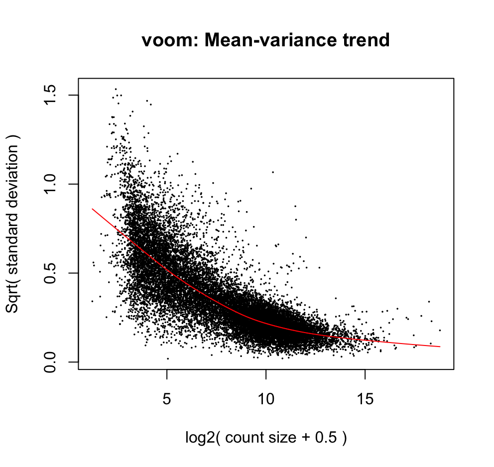
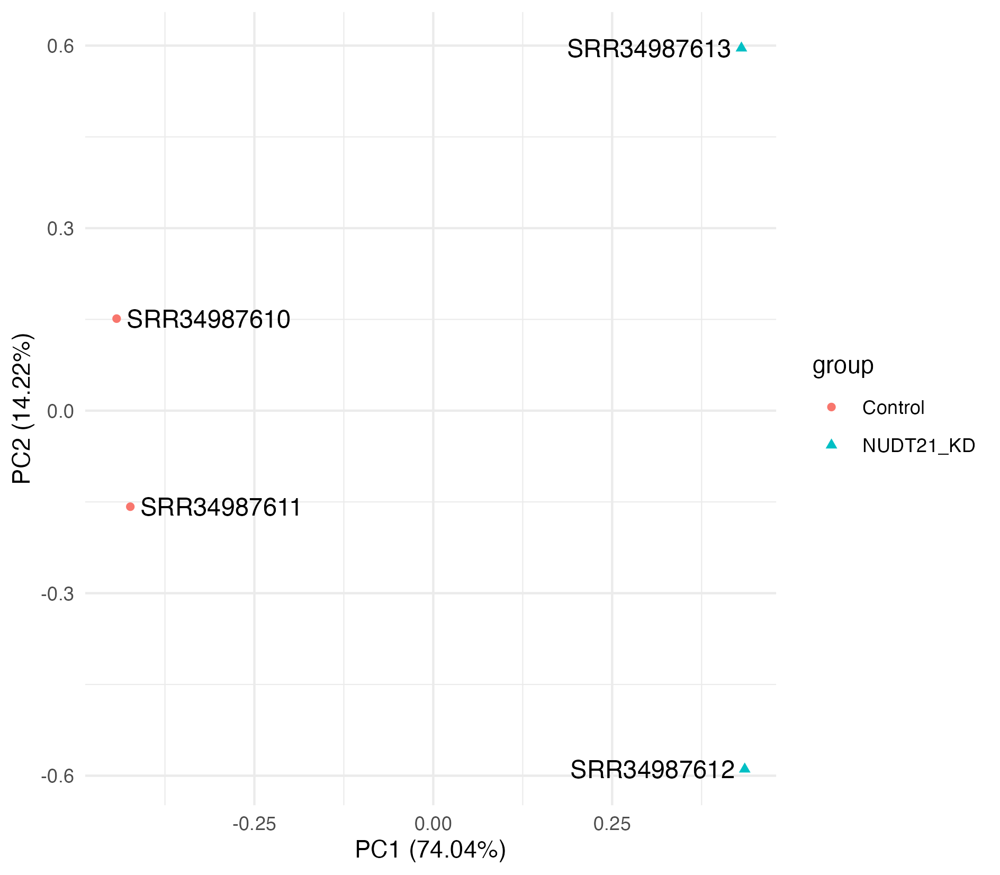
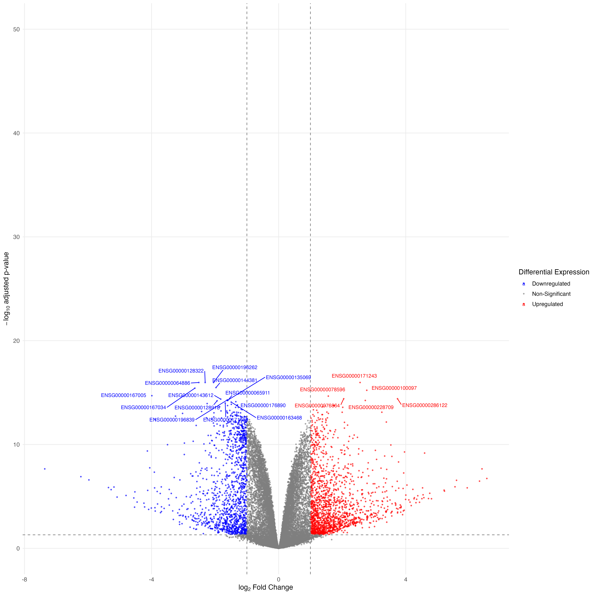
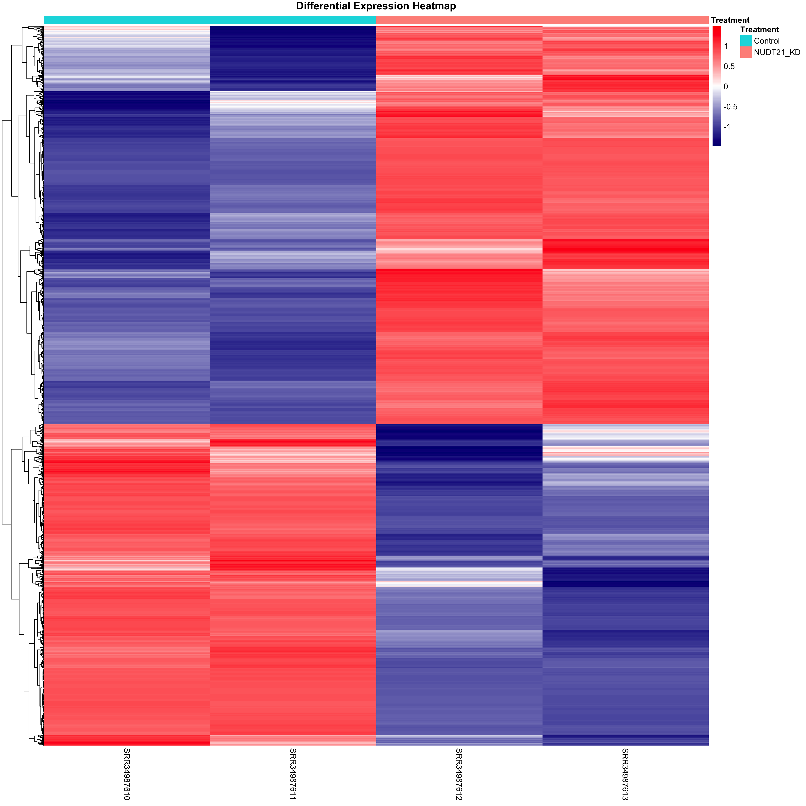
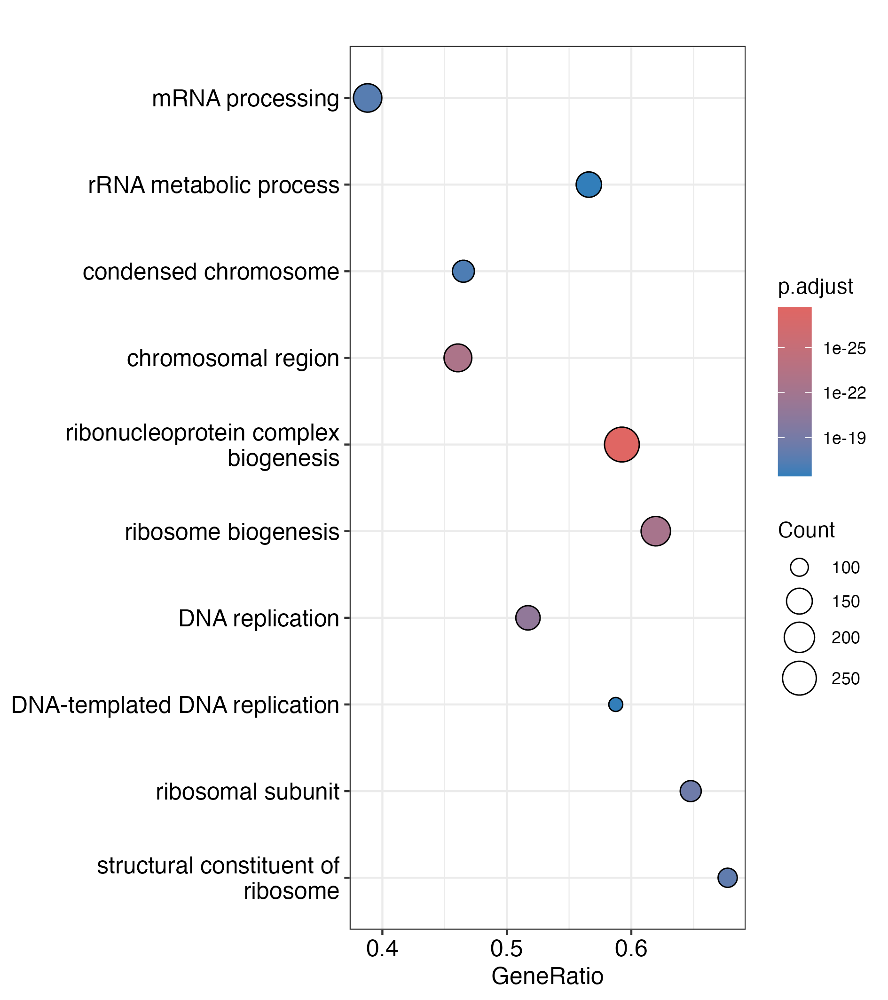
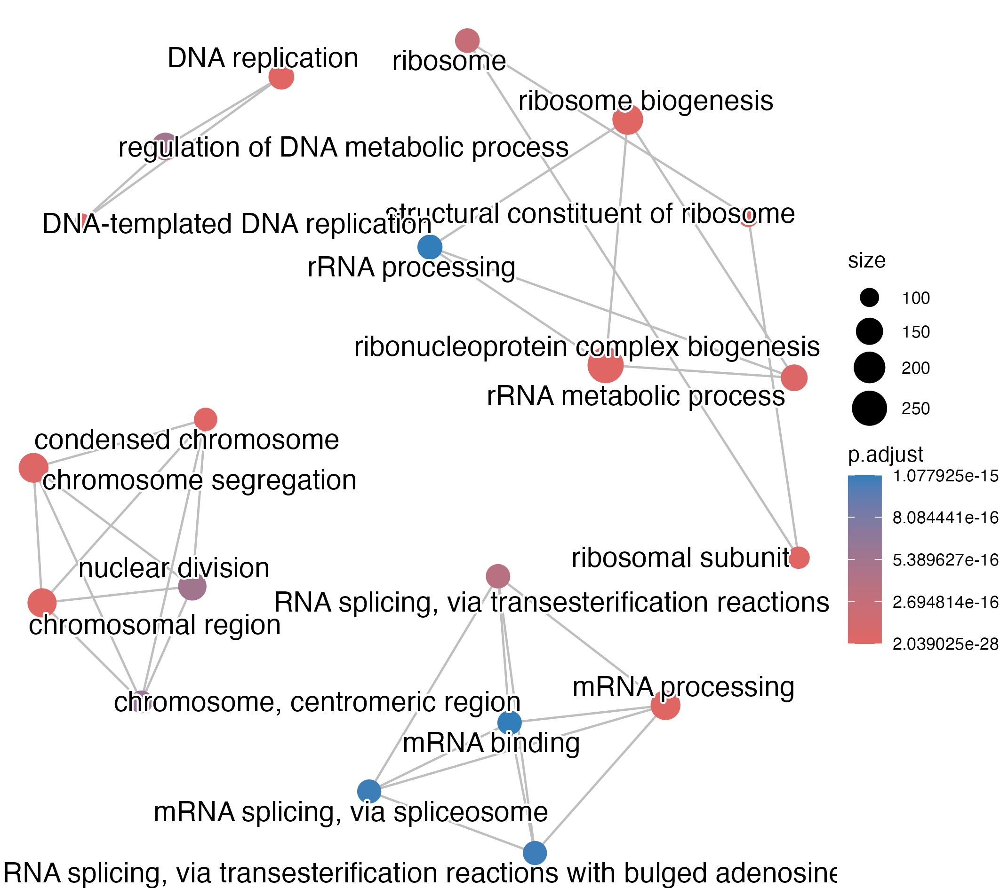

# RNA-seq Functional Analysis of NUDT21 Knockdown

## Project Overview
This project implements a fully reproducible RNA-seq analysis workflow to investigate the functional impact of **NUDT21** knockdown in human samples.

This pipeline includes: 
1. Preprocessing Data
2. Alignment & Annotation
3. Differential Expression
4. Functional Enrichment

## Objectives  
The objective of this project was to implement a reproducible RNA-seq bioinformatics workflow using FastQC, HISAT2, featureCounts, limma-voom, and clusterProfiler to identify differentially expressed genes and functionally enriched pathways following NUDT21 knockdown.

## Key Findings
- 11,450 genes (63%) were significantly differentially expressed (FDR < 0.05)
- Ribosome biogenesis and RNA processing pathways were strongly enriched
- PCA demonstrated clear separation between control and knockdown samples (PC1 = 74%)  
These results suggest that NUDT21 regulates core proliferative and RNA-processing programs.

## Dataset
RNA-seq samples retrieved from SRA (BioProject: PRJNA1305742)
 - 2 Control
 - 2 NUDT21 knockdown
**Genome reference**: GRCh38
**Annotation**: Ensembl Homo_sapiens.GRCh38

## Project Structure
### 1. Preprocessing Data (BASH)
*Ensures high-quality reads prior to alignment*  
#### 1.1 Data Download - Retrieved from NCBI SRA using ```prefetch```  
#### 1.2 Quality Control - Assessed using ```FastQC```  
#### 1.3 Adapter & Quality Trimming - Performed using ```Trimmomatic```  
#### 1.4 Post-trimming quality control - Re-evaluated using ```FastQC```  

### 2. Alignment & Annotation
*Pair-end RNA-seq reads aligned to human reference genome, sorted BAM files generated with samtools. Produce count-matrix for downstream DEG analysis by quantifying read counts*  
#### 2.1 Alignment - Align to GRCh38 index using ```HISAT2```  
#### 2.2 Alignment Quality Assessment - ```samtools flagstat``` + ```MultiQC```  
#### 2.3 Gene-level Quantification - ```featureCounts```  

### 3. Differential Expression (R)
#### 3.1 Filtering + TMM normalization - ```edgeR```  
#### 3.3 Linear modeling - ```limma-voom```  
#### 3.4 T-statistics ranking  
#### 3.5 PCA for QC

### 4. Functional Enrichment (R)
#### GO Gene Set Enrichment Analysis - ``` clusterProfiler``` 
#### Human gene annotation - ``` org.Hs.eg.db``` 
#### Enrichment visualization - ``` enrichplot ``` 

## File Structure
```
rna-seq-analysis/
├── data/
│   ├── ref/
│   ├── annot/
│   ├── trimmed/
├── results/
│   ├── figures/
│   ├── docs/
├── scripts/
│   ├── 01-rna-seq-processing.sh
│   ├── 02-differential-expression.R
│   └── 03-functional-enrichment.R
├── environment.yml
└── README.md
```

## Reproducible Environment
This project includes a Conda environment specification file (`environment.yml`) containing all required command-line tools and R/Bioconductor packages.
To recreate the environment:
```bash
conda env create -f environment.yml
conda activate rna-seq
```

## Results
### Alignment & Quality Control
All samples demonstrated high alignment efficiency (98.7–98.9% mapped reads) to the GRCh38 reference genome. Sequencing depth ranged from 56–85 million mapped reads per sample, providing sufficient coverage for differential gene expression.  
<p align="center">
  
</p> 

### Mean–Variance Modeling (voom)
The voom transformation modeled the mean–variance relationship of log-counts and generated precision weights for linear modeling, ensuring appropriate stabilization prior to differential expression analysis.
<p align="center">
  
</p> 

### Significant Genes
A total of 18,180 genes were tested for differential expression.  
- **11,450 genes (63%)** were significant at FDR < 0.05  
- 5,965 genes were upregulated  
- 5,485 genes were downregulated  
- 2,953 genes showed |log2FC| > 1  
- 1,701 genes were strongly upregulated (log2FC > 1)  
- 1,252 genes were strongly downregulated (log2FC < -1)  

These results indicate widespread transcriptomic changes following NUDT21 knockdown.

### Principal Component Analysis (PCA)
PCA of voom-transformed expression values revealed strong separation between control and NUDT21 knockdown samples along PC1 (74.04% variance explained). Reducing NUDT21 caused a major change in gene activity.
<p align="center">
  
</p> 

### Volcano Plot
The volcano plot illustrates the magnitude and statistical significance of gene expression changes. A large proportion of genes exhibited significant differential expression, consistent with extensive regulatory disruption.  
<p align="center">
  
</p> 

### Heatmap of Differentially Expressed Genes
Hierarchical clustering of significant genes shows clear separation between control and knockdown samples, confirming consistent expression patterns within groups and strong differential regulation between conditions.
<p align="center">
  
</p>

### GSEA Dot Plot
The dotplot highlights significant enrichment of gene sets involved in ribosome biogenesis, rRNA metabolic processes, DNA replication, and chromosome organization. High GeneRatio values and large gene counts indicate that a substantial proportion of differentially expressed genes participate in these pathways. These results suggest that NUDT21 knockdown disrupts core cellular processes involved in RNA regulation, protein synthesis, and cell division.
<p align="center">
  
</p>

### GSEA Enrichment Map
The enrichment map reveals four major functional clusters impacted by NUDT21 knockdown:
1. Ribosome biogenesis and rRNA metabolism  
2. RNA processing and splicing  
3. DNA replication  
4. Chromosome organization and mitotic cell cycle regulation

These clusters indicate that NUDT21 influences core cellular processes involved in RNA regulation, protein synthesis, and cell division.
<p align="center">
  
</p>

## Discussion
NUDT21 knockdown resulted in widespread transcriptomic changes, with 63% of tested genes showing significant differential expression (FDR < 0.05). Principal component analysis demonstrated strong separation between control and knockdown samples, indicating a shift in gene expression profiles. The magnitude and consistency of these changes suggest that NUDT21 may function as a broad regulator of transcriptomic programs rather than influencing only a limited subset of genes.

Functional enrichment analysis revealed significant disruption of pathways involved in RNA processing, ribosome biogensis, DNA replication and chromosome organization. These are core cellular systems for gene regulation, protein synthesis, and cell growth. The enrichment map demonstrated clustering of these pathways into coherent groups, indicating coordinated regulation rather than isolated gene effects. 

Collectively, these finding support a role for NUDT21 in maintaining RNA metabolism and proliferative pathways. Future work could extend this analysis to transcript-level regulation, alternative polyadenylation events, and non-coding RNA dynamics to further characterize the mechanistic consequences of NUDT21 depletion.
